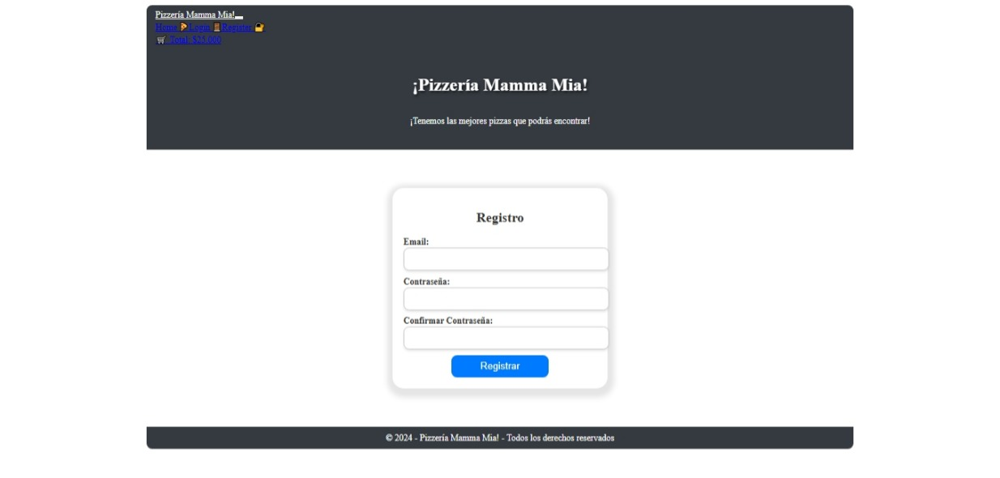

# componentes-eventos-g74
📘 Formulario de Registro en React
Este proyecto fue desarrollado como parte del aprendizaje de estados y eventos en React, siguiendo los lineamientos del programa de Desafío Latam.

🚀 Objetivo
Crear un componente Register con un formulario de registro que permita validar datos de entrada y manejar el estado interno de los campos del formulario.

🛠️ Tecnologías utilizadas
React

JavaScript

HTML y CSS

Vite (si aplica)

Node.js y npm para la ejecución local

🧩 Estructura del formulario
El componente Register incluye:

Campo de Email

Campo de Contraseña

Campo de Confirmar contraseña

Botón de Enviar

✅ Validaciones implementadas
Todos los campos son obligatorios.

La contraseña debe tener al menos 6 caracteres.

La contraseña y su confirmación deben coincidir.

📸 Capturas

🧪 Pruebas
Puedes probar el formulario llenando los campos y haciendo clic en el botón Enviar. Se mostrarán mensajes de éxito o error según la validez de los datos ingresados.

📁 Comentarios
Durante este hito se recomienda comentar el componente Home en App.jsx para enfocarse únicamente en el componente Register.

✍️ Autora
Doris Valverde Jara
Portafolio
GitHub